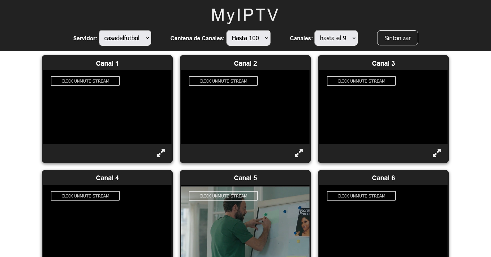

# MyIPTV

### Contenido

- [Descripción](#descripción-del-proyecto)
- [Captura](#captura)
- [Url del Proyecto](#link)
- [Tecnologías](#tecnologías-usadas)

### Descripción del Proyecto

Proyecto para ver los canales deportivos de distintos servidores seleccionando mediante selects el servidor, el interválo de centena de canales y el intervalo de decena de los mismos. Nos presentará en pantalla bloques de 10 canales con lo que están emitiendo en el momento.

### Captura

### link

- URL: [myiptv](https://jcarloscab.github.io/myiptv)

### Tecnologías usadas

HTML - CSS - BEM - FLEXBOX - JAVASCRIPT
